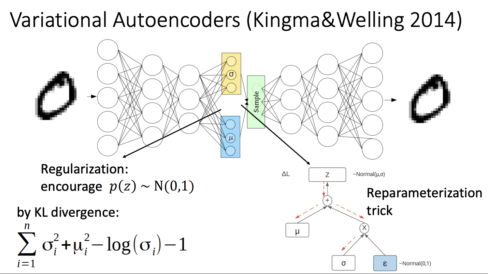
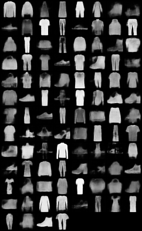
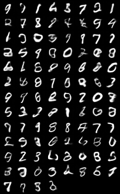

# Auto-Encoding-Variational-Bayes (VAE)




This project implements the models proposed in [ Auto-Encoding Variational Bayes (VAE)](https://arxiv.org/abs/1312.6114)
written by Diederik P Kingma and Max Welling.

The models were ran over the following datasets:
- MNIST
- MNIST Fashion
The results of the models can be found in [results.pdf](./results.pdf).




## Running the code
1. You can install the required libraries running
    ```bash
    pip install -r requirements.txt
    ```
2. Run:
    ```bash
    python3 train.py
    ```
